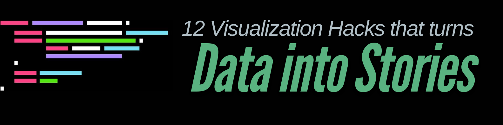
# 12 Visualization Hacks That Turn Data Into Stories

Turn raw numbers into memorable, meaningful narratives. This guide collects 12 practical visualization "hacks" — design patterns, techniques, and small code-ready examples — to help you communicate insights more clearly and persuasively. Each hack explains the problem it solves, when to use it, and an example or quick recipe you can apply with common tools.

## About
This repository collects concise, actionable techniques for turning data into stories using visualization. It is designed for analysts, data scientists, journalists, and anyone who needs to communicate data clearly. Examples use generic pseudocode and short Python snippets (matplotlib / seaborn / plotly) — let me know if you want full notebooks for each hack.

# Image Table (2 Columns × 12 Rows)

Below is a table with **2 columns and 12 rows**, each cell containing 12 compact images with names.

---

| Column 1 | Column 2 |
|----------|----------|
| 
 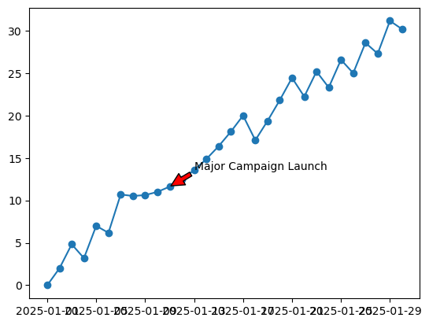  Image 1   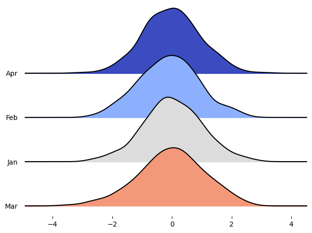  Image 2     Image 3   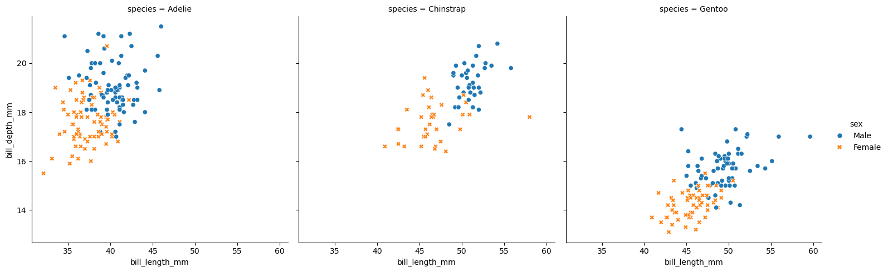  Image 4   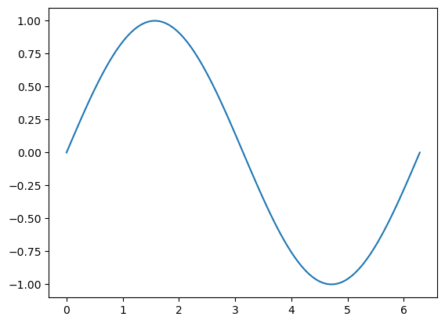  Image 5   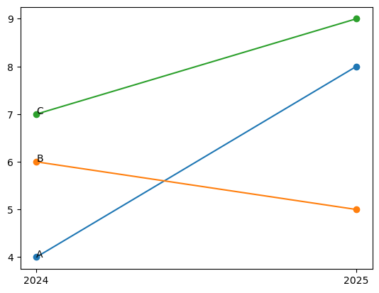  Image 6   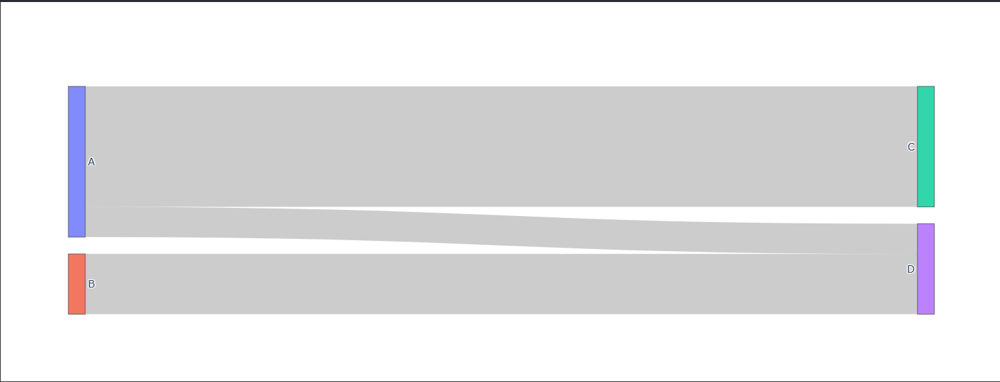  Image 7   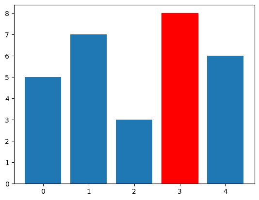  Image 8   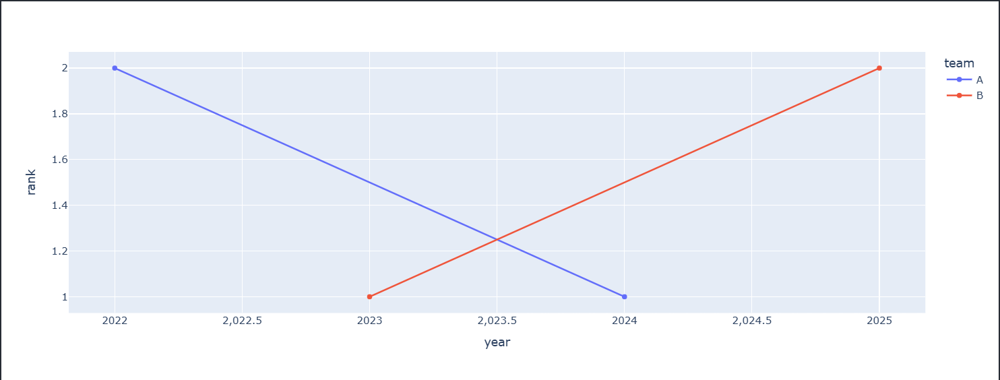  Image 9   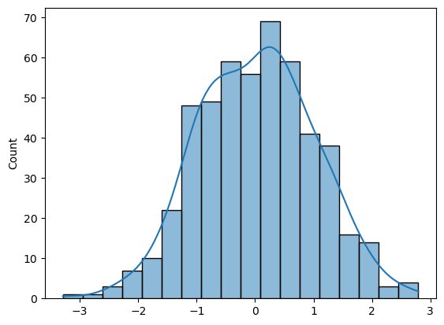  Image 10   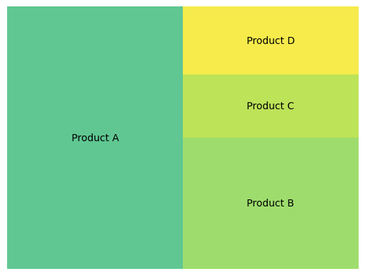  Image 11   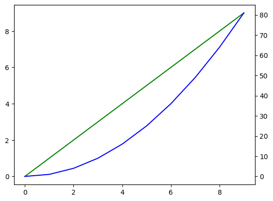  Image 12 
 | 
   Image 13     Image 14     Image 15     Image 16     Image 17     Image 18     Image 19     Image 20     Image 21     Image 22     Image 23     Image 24 
 |

---

## How to use this repo
- Read the 12 hacks for quick guidance.
- Browse the examples folder for runnable code and images.
- Copy recipes into your project and adapt styling to your brand.
- Open an issue or PR if you have a new hack or improved example.

## The 12 visualization hacks

1) Start with a single clear question
- Problem: Charts often try to answer too many questions at once.
- When to use: Always — anchor every visual to one main question.
- Recipe: Write a 1-sentence question and a 1-sentence answer before you plot.
- Example: "How has monthly active users changed over the last 12 months?" Answer: "Growth stalled in month 7 after a product change."

2) Choose the right visual form
- Problem: Wrong chart types hide patterns (e.g., pie charts for many categories).
- When to use: Before coding — pick chart type based on data structure and question.
- Quick guide:
  - Trend over time → line chart
  - Distribution → histogram, violin, boxplot
  - Part-to-whole → stacked bar or area (limited categories)
  - Relationship → scatter plot, hexbin
  - Ranking → bar chart (sorted)
- Example: Use horizontal bars for long category names and small multiples for comparing distributions across groups.

3) Emphasize what matters (visual hierarchy)
- Problem: All elements compete for attention.
- When to use: To draw attention to the key data point or trend.
- Recipe: Use size, weight, color contrast, and whitespace. De-emphasize less important lines with low alpha/gray.
- Example: Highlight one series in bright color, gray the rest.

4) Show comparisons directly
- Problem: Viewers must mentally compute differences.
- When to use: When comparing groups, segments, or time periods.
- Recipe: Use difference bars, slopegraphs, or dual-axis carefully. Consider direct labeling of values and deltas.
- Example: A slopegraph comparing sales in 2023 vs 2024 for top products.

5) Use annotation to tell the story
- Problem: Charts without context are ambiguous.
- When to use: To explain sudden moves, anomalies, or causal events.
- Recipe: Add short callouts, arrows, and short captions. Limit to 2–3 annotations.
- Example: Annotate product launch, policy change, or outlier with date and short note.

6) Use color deliberately
- Problem: Random color palettes confuse meaning.
- When to use: Always — color encodes meaning and guides the eye.
- Recipe:
  - Use color to encode categorical or sequential variables consistently.
  - Use perceptually uniform palettes (e.g., Viridis, CMOcean).
  - Avoid red/green combinations for accessibility.
  - Use one accent color for the main item and neutral for others.
- Example: Sequential palette for heatmaps, divergent palette for values around zero.

7) Remove chart junk (declutter)
- Problem: Excess gridlines, backgrounds, and ornamentation distract.
- When to use: To simplify and focus on data.
- Recipe: Remove heavy borders, reduce gridlines, simplify legends, use direct labels.
- Example: Light gray horizontal gridlines only, no chart background gradient.

8) Use small multiples for patterns
- Problem: Overlaying many lines or categories hides structure.
- When to use: When you need to compare the same measure across groups.
- Recipe: Create a grid of identical axes showing each subgroup. Keep scales consistent for direct comparison or use free scales when appropriate and explicitly note it.
- Example: 3x4 grid showing monthly sales by region.

9) Animate to reveal change over time
- Problem: Static snapshots can obscure change dynamics.
- When to use: When exploring transitions or story-driven presentations.
- Recipe: Animate a slide showing key frames, or use animated lines/points with subtle motion. Export as GIF/MP4 for sharing.
- Caution: Provide a static alternative for accessibility and reproducibility.
- Example: Animated scatterplot showing GDP vs life expectancy over years.

10) Bring context with reference lines and benchmarks
- Problem: Viewers lack a frame of reference for magnitude.
- When to use: When absolute values need interpretation.
- Recipe: Add median, target lines, or annotations marking benchmarks. Use subdued styling.
- Example: Horizontal line marking a 5% growth target.

11) Combine text + visuals (data-rich captions)
- Problem: Visuals alone may be misinterpreted.
- When to use: For reports, slide decks, and dashboards.
- Recipe: Add a 1-2 sentence caption: what you see and why it matters. Include key numbers (top-line and delta).
- Example: "Revenue rose 18% YoY, driven by a 30% increase in Region A."

12) Make it accessible and machine-readable
- Problem: Visualizations exclude those with color-vision deficiency and screen-reader users.
- When to use: Always, especially for public-facing content.
- Recipe:
  - Use alt text describing the chart and the takeaway.
  - Avoid color-only encoding; add shapes, labels, or patterns.
  - Export data as CSV and provide raw numbers.
  - Ensure sufficient contrast (WCAG AA).
- Example: Provide a short alt text: "Line chart showing monthly active users rising from 10k to 25k with a dip in July."

Examples and code snippets
- This repo includes minimal Python examples using matplotlib/seaborn/plotly illustrating the hacks:
  - Highlight a series: show how to set alpha for others and an accent color for one series.
  - Slopegraph example: code to produce a two-column slopegraph comparqing two years.
  - Small multiples: seaborn.FacetGrid example.
  - Annotated line chart: example with arrows and text.
- See /examples for runnable scripts and generated images.
