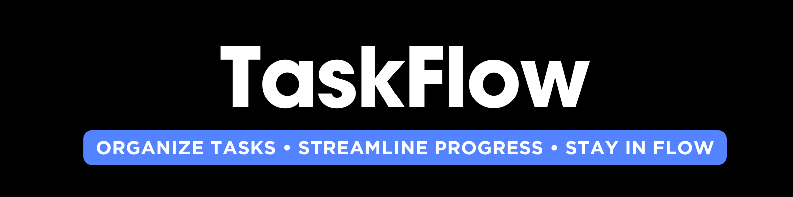

<div align="center">



*A full-featured Kanban-style project management application for tracking tasks and collaborating in real-time*


</div>

---

<div align="center">

## Tech Stack

| HTML5 | CSS3 | Bootstrap | JavaScript | PHP | MySQL |
|:---:|:---:|:---:|:---:|:---:|:---:|
|  |  |  |  |  |  |


</div>

---

<div align="center">

## Features

| Feature | Description |
|:---|:---|
| **Kanban Board** | Intuitive drag-and-drop interface for task management |
| **User Authentication** | Secure login and authorization system |
| **Analytics Dashboard** | Real-time progress tracking and insights |
| **Task Management** | Create, update, and organize tasks efficiently |
| **Responsive Design** | Seamless experience across all devices |
| **RESTful API** | Clean and scalable backend architecture |

</div>

---
<!---
## Project Structure

```
/
├── index.html          # Landing & Login page
├── dashboard.html      # Main application view
├── css/
│   ├── style.css
│   └── bootstrap.min.css
├── js/
│   ├── app.js          # Main application logic
│   ├── auth.js         # Authentication handling
│   └── dragdrop.js     # Drag and drop logic
├── api/
│   ├── config.php      # Database connection
│   ├── auth.php        # Auth endpoints
│   ├── tasks.php       # Task management endpoints
│   └── analytics.php   # Analytics endpoints
└── sql/
    └── schema.sql      # Database schema
```
--->
<div align="center">

## Quick Start Guide

</div>

**1. Clone the repository**
```bash
git clone https://github.com/ARUNAGIRINATHAN-K/Project_Management_System.git
cd project-management-app
```

**2. Import the database schema**
```bash
mysql -u root -p project_management < sql/schema.sql
```

**3. Configure database connection**
Update credentials in `api/config.php`

**4. Deploy to web server**
Apache/Nginx with PHP 8+

---

<div align="center">

## Requirements

| Component | Version |
|:---|:---:|
| PHP | 8.0+ |
| MySQL | 5.7+ |
| Web Server | Apache/Nginx |
| Browser | Modern (Chrome, Firefox, Safari, Edge) |

</div>

---

<div align="center">

## **Built for project management and collaborating**

### ⭐ Star this repo if you find it helpful!

</div>
